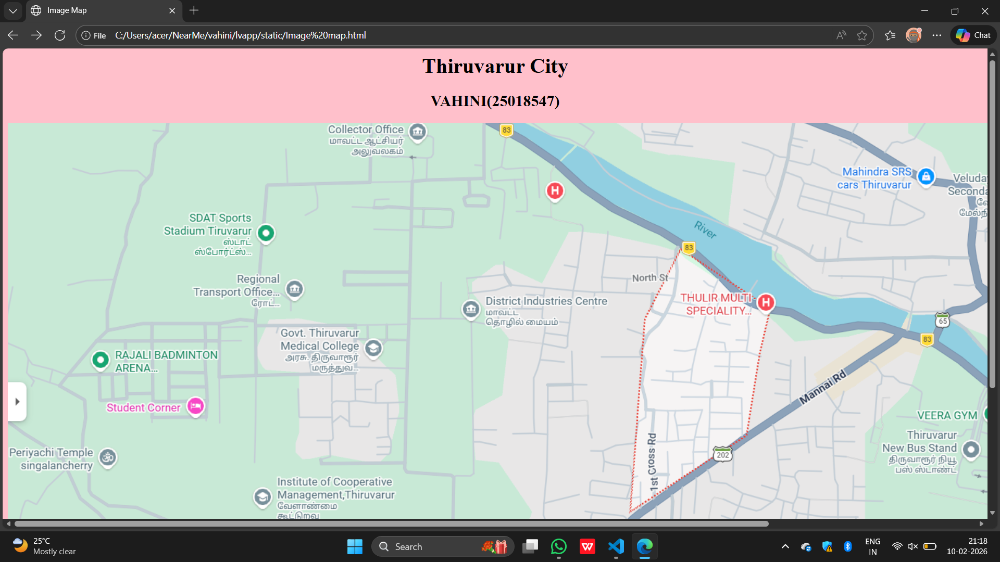
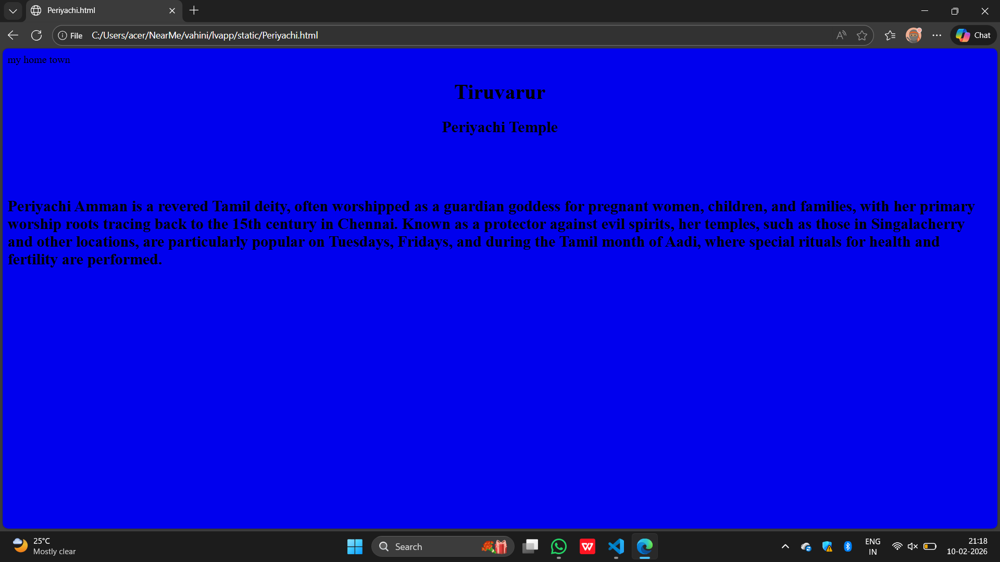
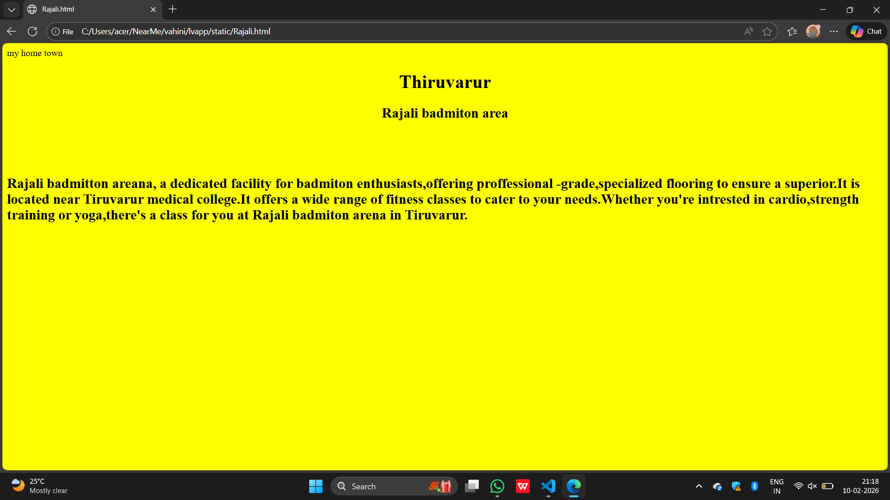
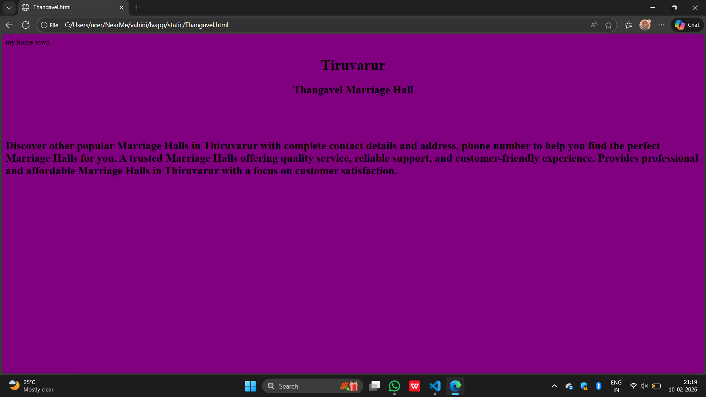
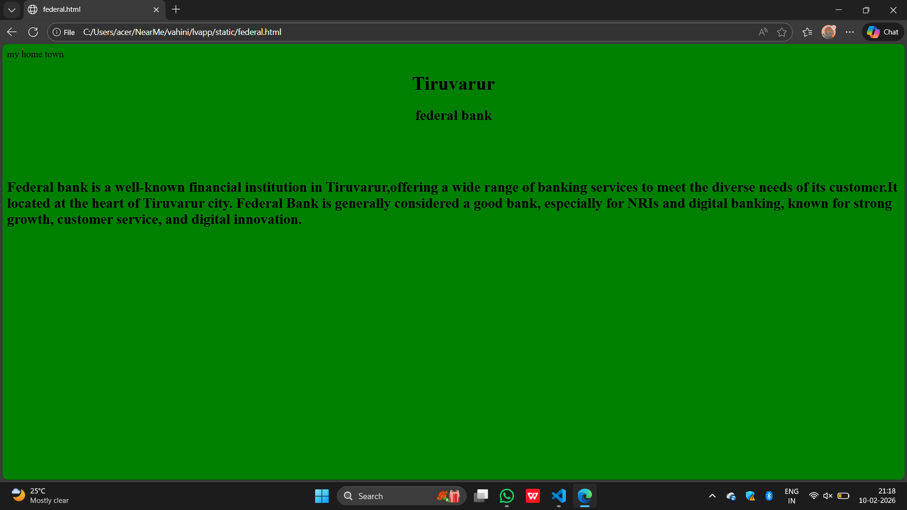
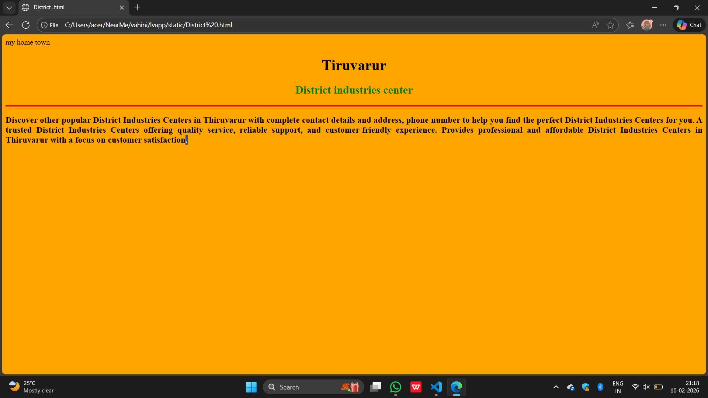

# Ex03 Places Around Me
## Date: 10.02.2026

## AIM
To develop a website to display details about the places around my house.

## DESIGN STEPS

### STEP 1
Create a Django admin interface.

### STEP 2
Download your city map from Google as an image.

### STEP 3
Insert the image using `````` tag and link it to the map.

### STEP 4
Using ```<map>``` tag name the map.

### STEP 5
Create clickable regions in the image using ```<area>``` tag.

### STEP 6
Write HTML programs for all the regions identified.

### STEP 7
Execute the programs and publish them.

## CODE
```
Image map.html
<html>
    <head>
        <title>Image Map</title>
    </head>
    <body bgcolor="pink">
        <h1 align="center">Thiruvarur City</h1>
       <h2 align="center">VAHINI(25018547)</h2>
        
      
<map name="image-map">
    <area target="" alt="Rajali badmiton arena" title="Rajali badmiton arena" href="Rajali.html" coords="344,399,105,302" shape="rect">
    <area target="" alt="Periyachi temple singalancherry" title="Periyachi temple singalancherry" href="Periyachi.html" coords="93,530,102" shape="circle">
    <area target="" alt="federal bank ATM" title="federal bank ATM" href="federal.html" coords="1394,765,1333,808,1338,854,1389,855,1426,820" shape="poly">
    <area target="" alt="Thangavel marriage html" title="Thangavel marriage html" href="Thangavel.html" coords="594,797,77" shape="circle">
    <area target="" alt="District industries center" title="District industries center" href="District .html" coords="829,212,726,243,748,334,823,368,899,335,885,247" shape="poly">
</map>
    </body>
</html>

Rajali.html

<html>
    <head>
        <tittle>my home town</tittle>
    </head>
    <body bgcolor="yellow" target="blank ">
        <h1 align="center">Thiruvarur
        </h1>
        <h2 align="center">Rajali badmiton area</h2>
        <br>
        <br>
        <br>
        <b>
        <h2>Rajali badmitton areana, a dedicated facility for badmiton enthusiasts,offering proffessional -grade,specialized flooring to ensure a superior.It is located near Tiruvarur medical college.It offers a wide range of fitness classes to cater to your needs.Whether you're intrested in cardio,strength training or yoga,there's a class for you at Rajali badmiton arena in Tiruvarur.
        </h2>
        
            </b>
    </body>
</html>

Periyachi.html
<html>
    <head>
        <tittle>my home town</tittle>
    </head>
    <body bgcolor="light green">
       <h1 align="center">Tiruvarur
    </h1>
    <h2 align="center">Periyachi Temple
    </h2>
    <br>
    <br>
    <br>
     <b>
        <h2>Periyachi Amman is a revered Tamil deity, often worshipped as a guardian goddess for pregnant women, children, and families, with her primary worship roots tracing back to the 15th century in Chennai. Known as a protector against evil spirits, her temples, such as those in Singalacherry and other locations, are particularly popular on Tuesdays, Fridays, and during the Tamil month of Aadi, where special rituals for health and fertility are performed. 
 </h2>
     </b>  
    </body>
</html>
Thangavel.html
<html>
    <head>
        <tittle>my home town</tittle>
    </head>
    <body bgcolor="purple">
        <h1 align="center">Tiruvarur</h1>
        <h2 align="center">Thangavel Marriage Hall</h2>
        <br>
        <br>
        <br>
        <b>
            <h2>Discover other popular Marriage Halls in Thiruvarur with complete contact details and address, phone number to help you find the perfect Marriage Halls for you. A trusted Marriage Halls offering quality service, reliable support, and customer-friendly experience. Provides professional and affordable Marriage Halls in Thiruvarur with a focus on customer satisfaction.</h2>
            </b>
    </body>
</html>
federal.html

<html>
    <head>
        <tittle>my home town</tittle>
    </head>
    <body bgcolor="green">
        <h1 align="center">Tiruvarur</h1>
        <h2 align="center">federal bank</h2>
        <br>
        <br>
        <br>
        <b>
            <h2>Federal bank is a well-known financial institution in Tiruvarur,offering a wide range of banking services to meet the diverse needs of its customer.It located at the heart of Tiruvarur city. Federal Bank is generally considered a good bank, especially for NRIs and digital banking, known for strong growth, customer service, and digital innovation.</h2>
        </b>
    </body>
</html>
District .html
<html>
    <head>
        <tittle>my home town</tittle>
    </head>
    <body bgcolor="orange" >
        <h1 align="center"><font color="black">Tiruvarur</font></h1>
        <h2 align="center"><font color="green">District industries center</font></h2>
        <hr size="3" color="red">
        <b>
            <h3 align="justify">Discover other popular District Industries Centers in Thiruvarur with complete contact details and address, phone number to help you find the perfect District Industries Centers for you. A trusted District Industries Centers offering quality service, reliable support, and customer-friendly experience. Provides professional and affordable District Industries Centers in Thiruvarur with a focus on customer satisfaction.</h3>
            </b>
    </body>
</html>
```

## OUTPUT







## RESULT
The program for implementing image maps using HTML is executed successfully.
